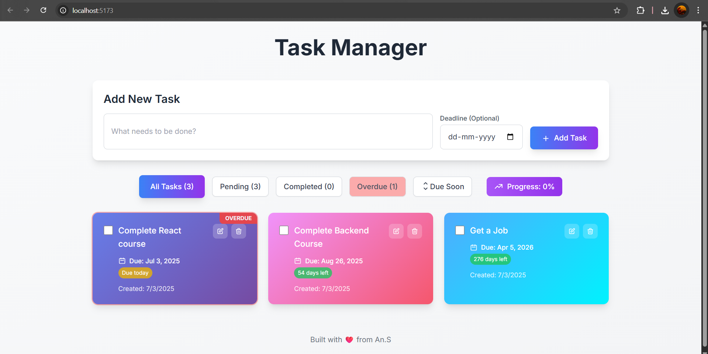

# MyTodo

MyTodo is a modern and user-friendly task management application built with React and Vite. 
Staying organized is key to productivity. MyTodo addresses the common need for a simple, distraction-free task manager. With a sleek interface and rapid setup, it empowers users to:

- Add, edit, and remove tasks effortlessly
- Keep track of progress and completed items
- Improve time management and workflow

Whether you are a student, professional, or just someone looking to boost personal productivity, MyTodo is designed to be intuitive and effective.

---

## Getting Started

Follow these steps to clone and run the project on your local machine:

### 1. Clone the repository

```sh
git clone https://github.com/Anshu3301/MyTodo.git
```
Go to that directory:
```sh
cd MyTodo
```

### 2. Install dependencies

Make sure you have [Node.js](https://nodejs.org/) , [npm](https://www.npmjs.com/) installed.
Then do:
```sh
npm install
```

### 3. Set-up Firebase and Install
Also set-up the Firestore(Google Firebase) and install Firebase in your project:
```bash
npm install Firebase
```

### 4. Set up environment variables

Create a `.env` file in the root directory of the project. 

```
# Add your environment variables here like:
VITE_FIREBASE_API_KEY = your key
```
Modify the values as needed for your setup.
- Remember to add **`VITE_`** prefix to all variable names.

### 5. Run the server

```sh
npm run dev
```

The application will start, and you can access it by navigating to [http://localhost:5173](http://localhost:5173) (or as specified in your terminal output).


### Demo:
[](demo.mp4)
